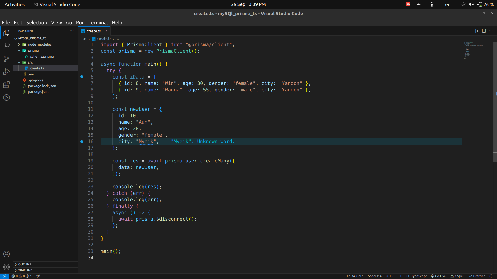
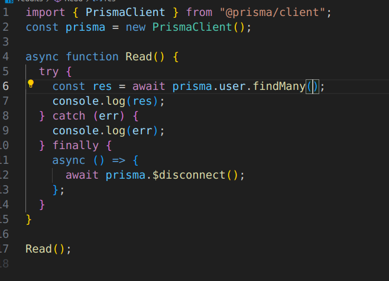
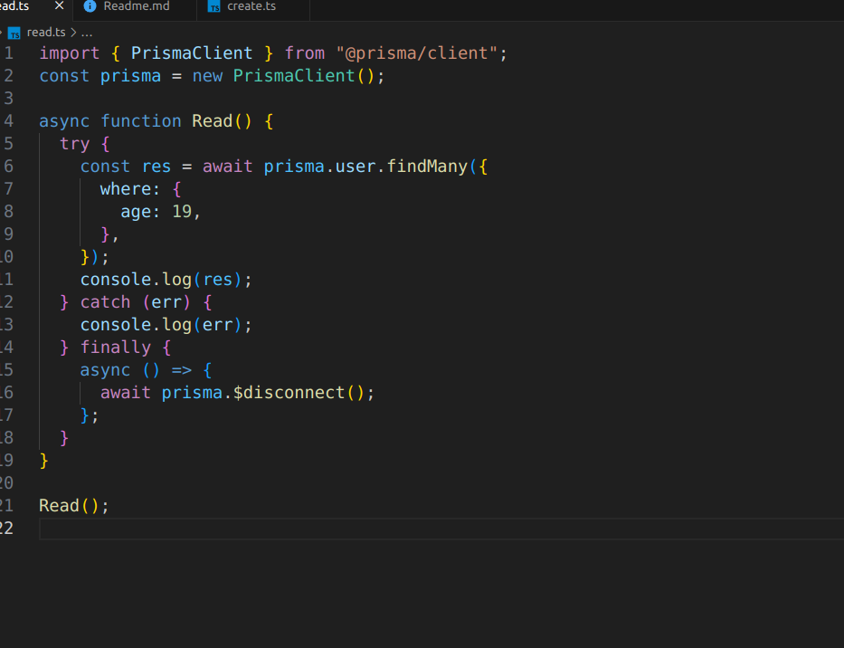
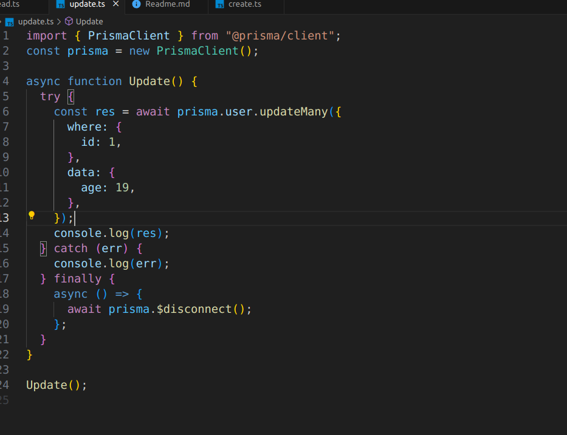
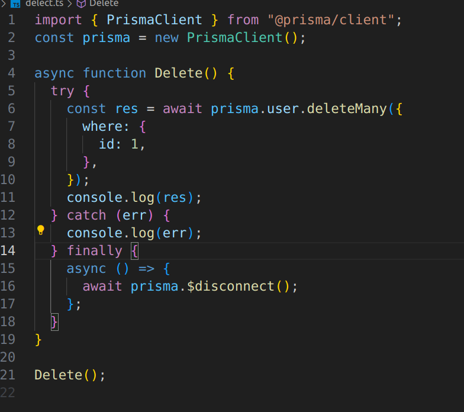

# Hello , Welcome to my mysql CRUD

<p style="font-size: 1.5rem;">အဲတာကို PrismaClient နဲ့သုံးထားတာပါ။</p>
<p>1.  npm int -y</p>
<p>2.  npm install Prisma typescript ts-node @types/node --save-dev</p>
<p>3.  npx prisma init</p>
<p>4.  .env file ထဲမှာ database url ထဲမှာ database name နဲ့ username password ထည့်</p>
<p>5.  Prisma folder ထဲမှာ provider မှာ mysql ပြောင်း</p>
<p>6.  npx prisma db pull ရိုက်လိုက် အဲဆိုရင် prisma ထဲမှာ model တွေကျလာလိမ့်မယ်</p>
<p>7.  npx prisma generate ဆိုပီးရိုက်လိုက် PrismaClient ကို import လုပ်</p>
<p>8.  run မယ်ဆိုရင် npx ts-node file path (eg. src/create.ts)</p>

```
Create
```

### Create With Array


<p></p>

### Create With Object



<p></p>

---

```
Read
```

### Read ALL With Where Condition



<p></p>

### Read With Where Condition



<p></p>

---

```
Update
```

### Update where Condition



<p></p>

---

```
Delete
```

### Delete Where Condition



<p></p>

---
